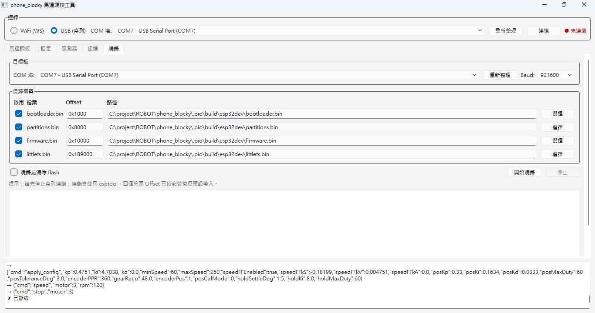
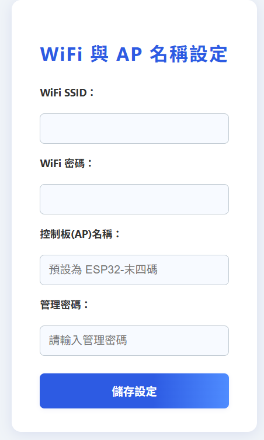
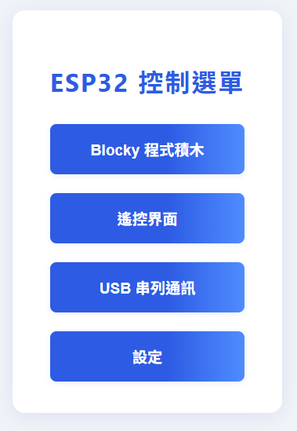
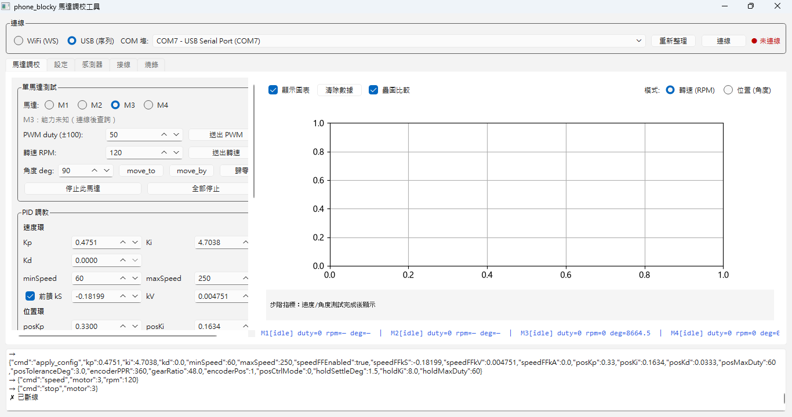
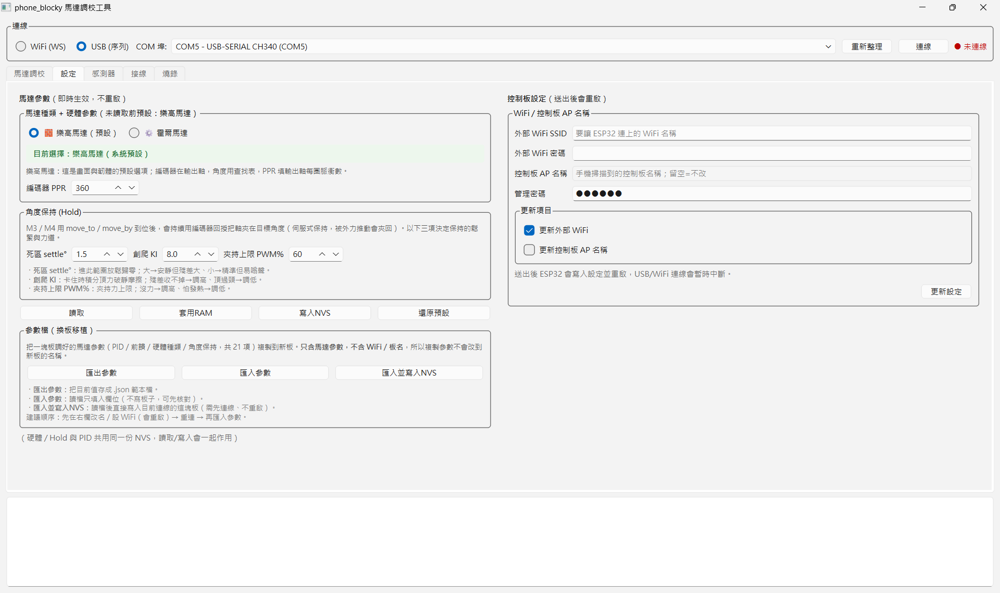
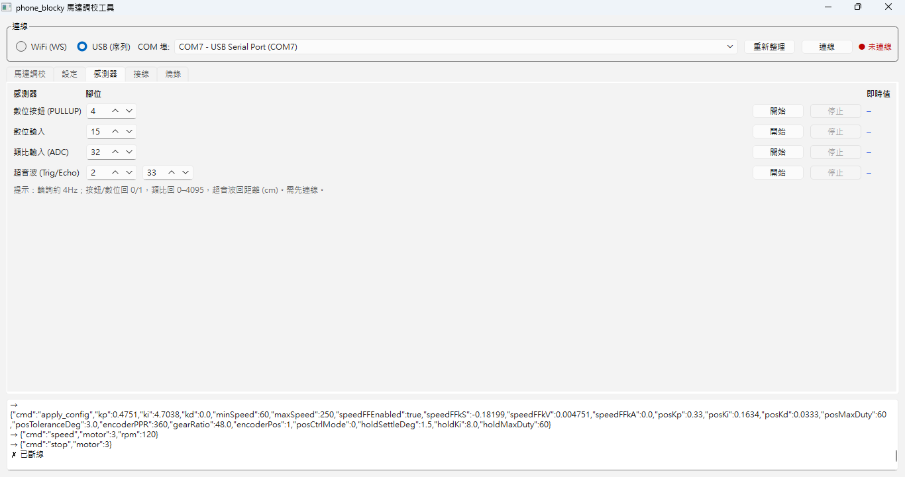
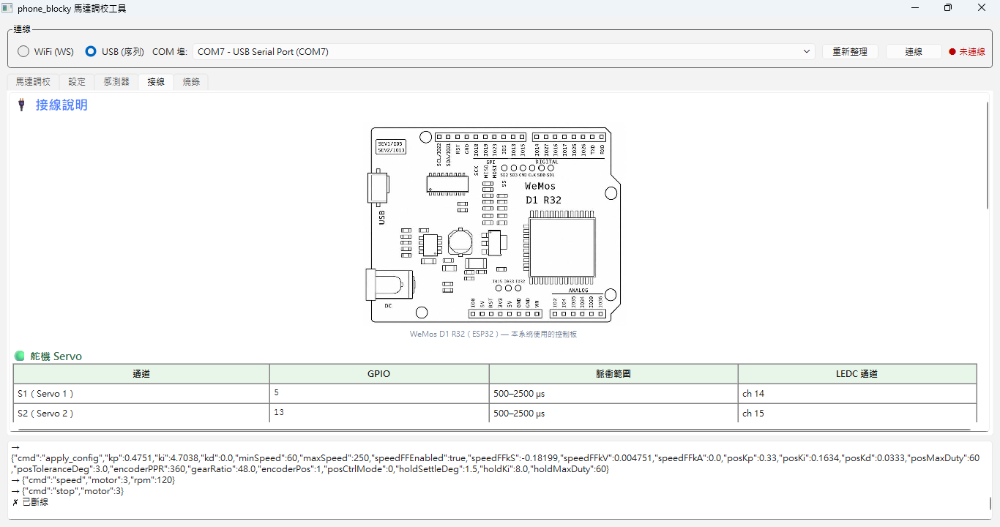

# 📦 Phone Blocky 安裝教程

> **適用硬體**：WeMos D1 R32（ESP32）+ AFMotor Shield
> **燒錄工具**：phone_blocky 馬達調校工具（`motor_tuner`，內建燒錄分頁）
> **更新日期**：2026-06-16

---

## 📋 目錄

1. [硬體準備](#硬體準備)
2. [用調校工具燒錄韌體](#用調校工具燒錄韌體)
3. [首次連線與設定](#首次連線與設定)
4. [系統頁面說明](#系統頁面說明)
5. [燒錄後：自動估速度 PID](#燒錄後自動估速度-pid)
6. [換板：複製調校參數到新控制器](#換板複製調校參數到新控制器)
7. [工具分頁總覽](#工具分頁總覽)
8. [硬體接線摘要](#硬體接線摘要)
9. [常見問題](#常見問題)
10. [相關文件](#相關文件)

---

## 🔧 硬體準備

在燒錄前，請先確認硬體已正確組裝：

1. 將 **AFMotor Shield** 插在 **WeMos D1 R32（ESP32）** 上
2. 用 USB 線把 ESP32 接上電腦（會在裝置管理員出現一個 COM 埠）
3. 準備好燒錄工具（下一節）；用打包好的 EXE 時，四個韌體 bin 已內建，不用自己找

---

## 🔥 用調校工具燒錄韌體

> 這是一個獨立的完整流程：**取得工具 → 開啟 → 在「燒錄」分頁寫入韌體 → 重啟**。
> 燒錄功能已整合在 **phone_blocky 馬達調校工具**（`motor_tuner`）裡，
> 不需要另外下載 Espressif Flash Download Tool。

### 步驟 1：取得並開啟工具

兩種方式擇一：

**方式一：打包好的 EXE（建議給非開發者）**

> 💡 這種「**一個 EXE 同時包含上傳韌體 ＋ 連線控制**」、給非開發者直接雙擊使用的整合程式，
> 業界稱為 **Configurator（一體式整合工具 / All-in-One Tool）**——
> 就像無人機圈的 *Betaflight Configurator*、*Mission Planner*：刷韌體、調參、即時控制全包在一個視窗。
> 本工具（`PhoneBlockyMotorTuner.exe`）就是 phone_blocky 的 Configurator。

直接雙擊 `PhoneBlockyMotorTuner.exe` 執行即可，**四個 bin 檔已內建在 EXE 內**，
可直接帶到任何 Windows 電腦燒錄，免裝 Python。

> EXE 由開發者用 `motor_tuner\build_exe.bat` 產生，輸出於
> `motor_tuner\dist\PhoneBlockyMotorTuner.exe`。要更新內建韌體時重跑該腳本即可。

**方式二：原始碼 + `run.bat`（開發／自行編譯韌體者）**

先確認電腦已安裝 **Python 3**（安裝時請勾選「Add python.exe to PATH」），然後：

```powershell
cd motor_tuner
.\run.bat
```

`run.bat` 會**自動**建立虛擬環境 `.venv`、安裝 `requirements.txt` 的相依（PyQt6、
matplotlib、pyserial、esptool…），再啟動工具。首次執行會花一點時間，之後就直接開啟。

> 此模式下燒錄分頁的 bin 檔路徑會**優先指向** `.pio\build\esp32dev\` 裡剛編譯出來的檔案，
> 方便邊改韌體邊燒錄（用 `pio run` / `pio run --target buildfs` 產生）。

工具開啟後，視窗標題為「phone_blocky 馬達調校工具」，最上方是**連線列**，下方分頁為
**馬達調校｜設定｜感測器｜接線｜燒錄**。燒錄請切到最右邊的「**燒錄**」分頁。



> ⚠️ **燒錄前務必先「斷線」**：esptool 需要獨占 USB 序列埠。若你已在最上方連線列用
> USB 連著板子，請先按「**斷線**」釋放 COM 埠，否則燒錄會被占用而失敗。

### 步驟 2：選擇目標板與 Baud

- **COM 埠**：工具會自動列出並預選最像 ESP32 的序列埠；接了多顆板子時，從清單手動挑要燒的那一顆。按「**重新整理**」可重抓。
- **Baud**：燒錄速率，預設 `921600`（最快）。若燒錄中途常斷線／報錯，可改 `460800` 或 `115200` 提升穩定度。

> 注意：燒錄分頁有**自己的 COM 埠選單**，與最上方連線列的 COM 埠是分開的兩處，以這裡選的為準。

### 步驟 3：確認燒錄檔案與 Offset

「燒錄檔案」區是四列表格，欄位為 **啟用 / 檔案 / Offset / 路徑 / 選擇**：

| bin 檔名稱 | Offset（地址） | 內容 |
|-----------|---------------|------|
| `bootloader.bin` | `0x1000` | 開機載入器 |
| `partitions.bin` | `0x8000` | 分區表 |
| `firmware.bin` | `0x10000` | 主韌體程式 |
| `littlefs.bin` | `0x1B9000` | 網頁靜態資源（LittleFS） |

> ⚠️ **非常重要**：每個分區的 Offset 必須完全對應，否則燒錄後 ESP32 可能無法正常啟動。
> 工具已**預設帶入**上述 Offset，一般情況不需更動。

- 四列預設都**已勾選「啟用」**，Offset 也已填好，通常直接用即可。
- 若某個檔路徑不對（顯示找不到），點該列右側「**選擇**」按鈕指定對應 `.bin`。
- 只想更新主程式、不動網頁時，可只勾 `firmware.bin`；但**首次燒錄請四個全燒**。

### 步驟 4（可選）：燒錄前清除 flash

勾選「**燒錄前清除 flash**」會先 `erase_flash` 整顆清空再寫入。
換韌體版本、或之前燒壞開不了機時建議勾；一般小更新可不勾以節省時間。

### 步驟 5：開始燒錄

確認已「斷線」釋放 USB 後，按「**開始燒錄**」。

- 進度與訊息會即時顯示在分頁下方的 log 區（底層呼叫 `esptool ... write_flash -z`，
  自動 `default_reset` 進入下載模式、`hard_reset` 重啟）。
- 燒錄中可按「**停止**」中止。
- 看到 log 顯示「**燒錄完成，請重新啟動 ESP32**」即成功。

### 步驟 6：重新啟動 ESP32

燒錄完成後重新啟動（重新插拔電源或按板上 RST）。開機後就會建立 WiFi 熱點，
接著進行下一節的[首次連線與設定](#首次連線與設定)。

---

## 📶 首次連線與設定

### 步驟 1：選擇 AP 連線

燒錄完成重啟後，在手機或電腦的 WiFi 清單中找到 ESP32 的熱點：

- 熱點名稱：`ESP32-XXXXXX`（例如：`ESP32-DB50`）
  > `DB50` 是該 ESP32 的 MAC 位址末四碼
- **AP 連線密碼**：`12345678`

### 步驟 2：開啟控制頁面

連線成功後，在瀏覽器輸入 `192.168.4.1` 即可進入首頁。

> 💡 **建議**：若沒有特別需求，建議使用 **AP 模式**，只需重新設定控制板名稱即可，無需設定 WiFi 帳密。

### 步驟 3：修改控制板名稱與 WiFi 設定（可選）

如果需要設定不同的控制板名稱及 WiFi 帳密（使用 **STA 模式**時才需要），點擊設定按鈕進入設定頁面，管理密碼為 `123456`：



設定完控制板名稱（例如：`66`）及 WiFi 帳密後，點選「**儲存設定**」。

重啟後，查看熱點列表時，可以發現原本的 `ESP32-DB50` 不見了，改為 `66-192.168.X.X`。

此時，可以選擇：
- **AP 連線**：直接連接 ESP32 熱點（如上方步驟）
- **STA 連線**：將手機（電腦）連線相同的網域後，使用 `192.168.X.X` 的方式進行連線

> 💡 設定頁也整合在調校工具的「**設定**」分頁裡（WiFi／控制板名稱／馬達種類／編碼器 PPR／減速比／角度保持），
> 走相同的 `cmd:` 協定，WiFi 與 USB 兩種連線皆可用。

---

## 🌐 系統頁面說明

ESP32 開機後會建立 WiFi 熱點，用手機或電腦連上後可開啟以下頁面：

| 網址 | 功能 |
|------|------|
| `192.168.4.1/` | 🏠 首頁（功能選單） |
| `192.168.4.1/blocky` | 🧩 積木程式編輯器 |
| `192.168.4.1/joy` | 🕹️ 搖桿控制頁面 |
| `192.168.4.1/usb` | 🔌 串列控制頁面 |
| `192.168.4.1/set` | ⚙️ 控制板子名稱及熱點 WiFi 帳密設定 |

連線成功後，開啟手機瀏覽器進入 `192.168.4.1` 即可看到如下首頁畫面：



> 💡 上面是**機器人本體的網頁**；前面用來燒錄、調 PID 的「馬達調校工具」是跑在
> **電腦上的桌面程式**，兩者用途不同，別搞混。

---

## 🤖 燒錄後：自動估速度 PID

韌體燒好後，可以直接用調校工具的「**自動估**」一鍵量出速度環 PID（只有 **M3、M4** 有編碼器，
可做閉迴路；M1／M2 僅開迴路 PWM）。

1. 在最上方連線列選 **USB (序列)** 選好 COM 埠（或 **WiFi (WS)** 填 `192.168.4.1`），按「**連線**」。
2. 切到「**馬達調校**」分頁，馬達選 **M3** 或 **M4**。
3. 到下方「**自動估速度 PID**」區，設定「高準位 PWM(%)」（預設 80%）與「響應」（保守／中等／積極），按「**開始自動估**」。
   - 工具會送幾段開迴路 PWM、用韌體 50Hz 高速擷取量上升段，自動擬合出前饋 kS/kV 與 Kp/Ki。
   - **前饋會自動套用到 RAM**；Kp/Ki 會**填入欄位**。
4. 按「**套用RAM**」讓 PID 生效，再「**送出轉速**」（例如 120 RPM），從右側「實際 vs 目標」曲線確認收斂。
5. 滿意後按「**寫入NVS**」永久保存；要回原廠值按「**還原預設**」。

> ⚠️ 自動估的高速擷取需要**較新的韌體**（含 `chart_buffer` 支援）。若狀態列顯示
> 「高速緩存無回應」，代表板上韌體太舊，請依[用調校工具燒錄韌體](#用調校工具燒錄韌體)重燒一次。

---

## 🔄 換板：複製調校參數到新控制器

本控制器作為課堂教具，常需要「**燒一塊新板 → 改名 → 把已調好那塊板的參數搬過來**」。
調校工具「設定」分頁左欄提供**參數檔匯出／匯入**，把一塊板調好的馬達參數（PID、前饋、
硬體種類、角度保持，共 21 項）複製到任意數量的新板。

> 📌 匯出／匯入**只含馬達參數**（NVS `motor`），**不含 WiFi 與板名**（NVS `wifi`）。
> 所以每塊板都會保留自己唯一的板名，不會因為複製參數而全班同名。

### A. 從已調好的板子匯出參數（做一次即可，存成範本檔）

1. 連線那塊**已調好**的控制板（USB 或 WiFi 皆可）；連線後工具會自動讀回該板現值並填入欄位。
2. 切到「**設定**」分頁，在左欄「馬達參數」按「**匯出參數**」。
3. 選位置存檔，預設檔名 `motor_params_<日期時間>.json`。建議放在固定資料夾當「標準參數範本」。

### B. 把參數寫進新燒好的板子

1. 先完成新板的[燒錄](#用調校工具燒錄韌體)。
2. （建議先做）到「設定」分頁**右欄**改好這塊新板的 **AP 名稱／WiFi** 並送出——這步**會重啟**。
3. 重啟後**重新連線**這塊新板。
4. 在左欄按「**匯入並寫入NVS**」，選剛剛存的 `.json`：工具會把參數套用並寫入這塊板的 NVS，
   **不會重啟**。看到 log 出現「✓ 已寫入 NVS」即完成。

> 💡 想先核對再寫，可改按「**匯入參數**」——只把數值填進欄位、不動板子；確認無誤後再按
> 「**套用RAM**」（試）或「**寫入NVS**」（存）。

> ⚠️ **順序建議**：先改名／WiFi（會重啟）→ 重連 → 再匯入參數（不重啟）。
> 反過來雖然改名的重啟不會洗掉已寫好的馬達參數，但會多一次無謂的斷線重連。

---

## 🧰 工具分頁總覽

工具最上方是所有分頁共用的**連線列**，最下方是共用的**訊息 log 區**；中間切換五個分頁。

### 🔗 連線列（最上方，所有分頁共用）

| 元件 | 說明 |
|------|------|
| `WiFi (WS)` / `USB (序列)` | 傳輸方式二選一（連線中無法切換） |
| `ESP32 IP` | WiFi 模式輸入，預設 `192.168.4.1`（AP 模式）；走 `ws://<ip>/ws`（埠 80） |
| `COM 埠` + 重新整理 | USB 模式選序列埠（115200），自動預選最像 ESP32 的埠 |
| 連線／斷線 | 切換連線；右側 `●` 燈顯示連線狀態 |

> 只有 **M3、M4 有編碼器** → 轉速／位置閉迴路與曲線只對這兩顆有意義；M1／M2 僅能開迴路 PWM。連線後工具會自動查詢各馬達能力。

### 1️⃣ 馬達調校分頁

左半邊是控制區（三個區塊），右半邊是即時曲線。



**🔹 單馬達測試**

| 控制 | 說明 |
|------|------|
| 馬達 M1–M4 | 選擇要操作的馬達 |
| `PWM duty (±100)` + 送出 PWM | 開迴路驅動，正轉/反轉（全部馬達適用） |
| `轉速 RPM (±250)` + 送出轉速 | 閉迴路定速（限 M3／M4） |
| `角度 deg` + move_to／move_by／歸零 | 絕對角度／相對角度／編碼器歸零（限 M3／M4） |
| 停止此馬達／全部停止 | 立即停止 |

**🔹 PID 調教**

- **速度環**：`Kp / Ki / Kd`、`minSpeed / maxSpeed`（注意：這兩個是**輸出 PWM 上下限**，非 RPM；韌體換算 duty = 值 × 100 ÷ 255）、`前饋 kS` 勾選 + `kS / kV`（前饋公式 `duty = kS + kV × |目標RPM|`）。
- **位置環**：`posKp / posKi / posKd`、`posMaxDuty`、`posTolDeg`（到位容差）。
- **參數生命週期**（速度環＋位置環整批操作，NVS 以 `motor` 命名空間存取）：
  - **讀取** → 回填韌體目前值（連線後自動執行一次）
  - **套用RAM** → 立即生效但不寫 NVS（重開機會丟失）
  - **寫入NVS** → 永久保存（寫入有檢查，失敗會回報）
  - **還原預設** → 回 `config.h` 出廠值

**🔹 自動估速度 PID**

| 控制 | 說明 |
|------|------|
| `高準位 PWM(%)` | 掃描最高準位，預設 80（範圍 35–95） |
| `響應` | 保守（穩）／中等／積極（快）—— 決定 PID 積極程度 |
| 開始自動估 | 開迴路掃描 → 自動算前饋 kS/kV 與速度 Kp/Ki（前饋自動套 RAM、PID 填欄位） |
| 填入速度 PID 欄位 | 把算出的 Kp/Ki 再填一次到上方欄位 |
| 自動估角度 PID | 速度估完後，依內環 τ 串級推算位置環 PID |
| 填入角度 PID 欄位 | 把算出的 posKp/posKi/posKd 填入 |

**🔹 右側即時曲線**

「實際 vs 目標」曲線：`模式` 切 轉速(RPM)／位置(角度)；`顯示圖表` 開關記錄；`清除數據` 清空；`疊圖比較` 把多次測試疊在一起對照。下方藍字是即時遙測（各馬達 duty／rpm／deg）。

### 2️⃣ 設定分頁（移植自網頁 `set.html`）



分成**左右兩欄**，對應板上兩份**互不影響**的設定：

**左欄：馬達參數**（即時生效、**不重啟**；存於 NVS `motor` 命名空間）

| 區塊 | 內容 |
|------|------|
| **馬達種類 + 硬體參數** | 🧱 樂高馬達（預設）／⚙️ 霍爾馬達切換、`編碼器 PPR`（預設 360）、`減速比`（預設 48，選霍爾才需填） |
| **角度保持 (Hold)** | `死區 settle°`（1.5）、`創爬 KI`（8.0）、`夾持上限 PWM%`（60） |
| **生命週期** | 讀取／套用RAM／寫入NVS／還原預設（與馬達調校頁的 PID 共用同一份 NVS，會一起作用） |
| **參數檔** | 匯出參數／匯入參數／匯入並寫入NVS —— 換板移植調校參數用，詳見[換板：複製調校參數到新控制器](#換板複製調校參數到新控制器) |

**右欄：控制板設定**（送出後 ESP32 寫 NVS 並**自動重啟**，連線會中斷；存於 NVS `wifi` 命名空間）

| 區塊 | 內容 |
|------|------|
| **WiFi / 控制板 AP 名稱** | 外部 WiFi SSID／密碼、控制板 AP 名稱、管理密碼（預設 `123456`）；勾選「更新外部 WiFi／更新 AP 名稱」決定要送哪些 |

> 左欄（馬達參數）與右欄（控制板設定）是**兩份獨立的 NVS**：複製馬達參數不會動到 WiFi／板名，所以每塊板都能保留自己唯一的板名。

### 3️⃣ 感測器分頁（即時測試，參考 `hardware_test.html`）

四列一鍵測試，每列可改 GPIO、按「開始／停止」（約 4Hz 輪詢）、右側顯示即時值。**需先連線**。



| 感測器 | 預設腳位 | 回傳 |
|--------|---------|------|
| 數位按鈕 (PULLUP) | GPIO 4 | 0／1 |
| 數位輸入 | GPIO 15 | 0／1 |
| 類比輸入 (ADC) | GPIO 32 | 0–4095 |
| 超音波 (Trig/Echo) | Trig 2 / Echo 33 | 距離 (cm) |

### 4️⃣ 接線分頁（純顯示）

板子圖（WeMos D1 R32）＋完整腳位參考表：舵機、M3/M4 編碼器、使用者可用腳位、樂高 NXT/EV3 RJ12 接頭線序、以及被系統佔用的禁用腳位。詳見本文[硬體接線摘要](#硬體接線摘要)。



### 5️⃣ 燒錄分頁

把四個分區 bin 寫入 ESP32。完整步驟見[用調校工具燒錄韌體](#用調校工具燒錄韌體)。

---

## 🛠️ 硬體接線摘要

### 馬達（AFMotor Shield）

| 馬達 | 有無編碼器 |
|------|-----------|
| M1（AFMotor 1） | ❌ 無 |
| M2（AFMotor 2） | ❌ 無 |
| M3（AFMotor 3） | ✅ 有（A=GPIO35, B=GPIO34） |
| M4（AFMotor 4） | ✅ 有（A=GPIO36, B=GPIO39） |

### 舵機（Servo）

| 通道 | GPIO | 脈衝範圍 |
|------|------|---------|
| S1（Servo 1） | GPIO 5 | 500–2500 µs |
| S2（Servo 2） | GPIO 13 | 500–2500 µs |

### 感測器可用腳位

| GPIO | 功能 |
|------|------|
| `2` | 數位輸出 / 超音波 Trig（也是板子 LED） |
| `4` | 數位輸入 / 樂高按鈕（INPUT_PULLUP） |
| `15` | 數位輸入 |
| `26` | PWM / 類比輸出（支援 DAC） |
| `32` | 類比讀取（ADC） |
| `33` | 超音波 Echo / 類比讀取 |

> 💡 調校工具的「**接線**」分頁有完整板子圖與腳位參考表，「**感測器**」分頁可即時測各腳位讀值。

---

## ❓ 常見問題

### Q1：燒錄時找不到 COM 埠？
- 確認已安裝 USB 驅動（CH340 或 CP2102，依板子型號）
- 在 Windows 裝置管理員中確認 COM 埠號，回工具按「重新整理」
- 嘗試更換 USB 線或 USB 埠

### Q2：按「開始燒錄」沒反應或顯示埠被占用？
- 燒錄前**務必先在最上方連線列按「斷線」**，釋放 USB 序列埠
- 確認沒有其他程式（序列監視器、Arduino IDE 等）占用同一個 COM 埠

### Q3：燒錄中途斷線 / `A fatal error occurred`？
- 把 **Baud 從 921600 改成 460800 或 115200** 再試
- 換一條品質較好的 USB 資料線、避免用 USB Hub
- 勾「燒錄前清除 flash」後重燒

### Q4：燒錄後開機沒有 WiFi 熱點？
- 確認 4 個分區檔案都有勾選並燒錄成功（log 無紅字錯誤）
- 確認地址（Offset）正確，尤其是 `0x1000` 和 `0x10000`
- 勾「燒錄前清除 flash」清空後重新四個全燒

### Q5：網頁打開是空白或 404？
- `littlefs.bin` 可能未成功燒錄，地址需為 `0x1B9000`
- 重新燒錄 `littlefs.bin`，確認地址正確

### Q6：用原始碼 `run.bat` 開不起來 / 裝相依失敗？
- 確認已安裝 Python 3 且勾過「Add python.exe to PATH」
- 直接刪掉 `motor_tuner\.venv` 資料夾再跑一次 `run.bat`，會自動重建環境
  （已放寬 numpy 版本，Python 3.13 也能順利安裝）

### Q7：WebSocket 連線失敗？
- 確認手機/電腦連接的是 ESP32 的熱點（而非其他 WiFi）
- 嘗試重新整理頁面或重啟 ESP32
- 確認 IP 位址正確（AP 模式下應為 `192.168.4.1`）

### Q8：馬達沒有反應？
- 進入 `192.168.4.1/hardware_test`，或用調校工具「感測器」分頁執行測試
- 確認 AFMotor Shield 已正確插入 ESP32
- 確認馬達電源供應充足（建議 7.4V–12V）

### Q9：換新板想沿用舊板調好的參數，怎麼搬？
- 用「設定」分頁左欄的**匯出參數**／**匯入並寫入NVS**，詳見[換板：複製調校參數到新控制器](#換板複製調校參數到新控制器)
- 匯出檔**只含馬達參數**，不含 WiFi／板名；複製參數不會讓新板被改名，板名仍需在右欄各自設定
- 「匯入並寫入NVS」需**先連線**到要寫入的那塊板

---

## 📚 相關文件

- [操作說明書](操作說明書.md) — 各網頁頁面的詳細操作說明
- [motor_tuner 說明](../motor_tuner/README.md) — 調校工具的功能、分頁與打包說明
- [接線說明](../data/wiring.html) — 完整硬體接線圖（ESP32 上查看）
- [腳位對照表](腳位.md) — GPIO 腳位詳細說明
- [指令格式說明](prog_json_schema.md) — JSON 指令協議
- [更新紀錄](更新紀錄.md) — 版本更新歷史

---

*文件版本：v3.2*
*更新日期：2026-06-17*
*適用系統：ESP32 Phone Blocky 控制器*
